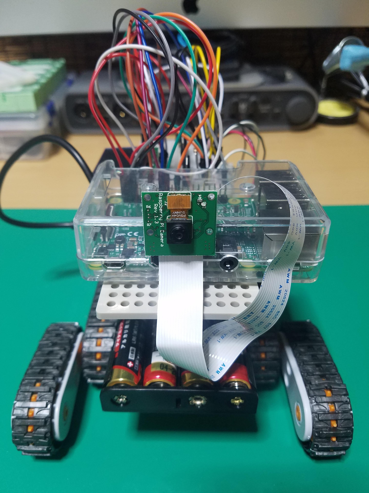
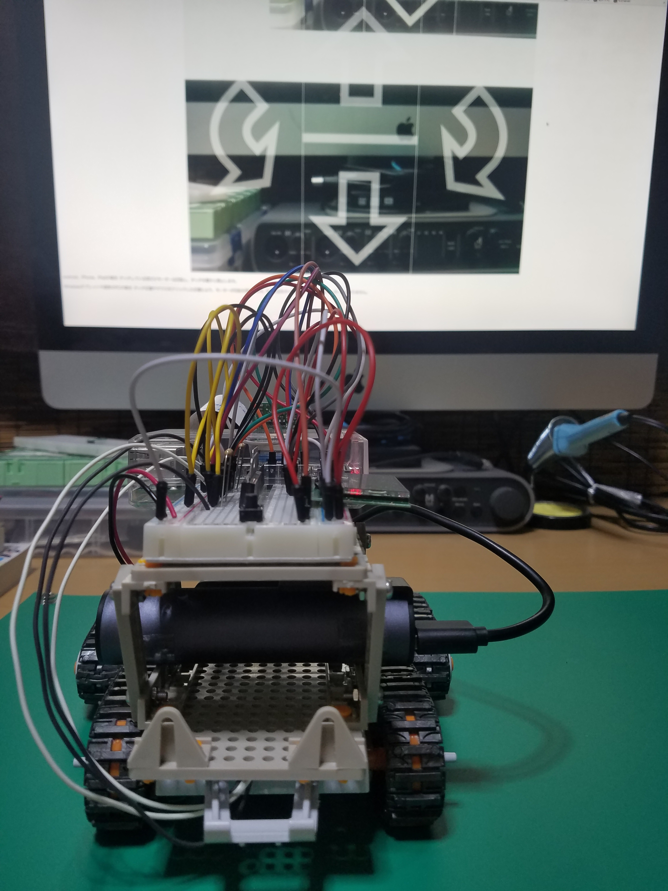

# Raspberry Pi car

#### ■ Raspberry Pi car
「Raspberry Pi」を搭載した模型をPCやスマートフォンからラジコンのように操作できます、
「Raspberry Piで学ぶ電子工作」という本を参考にして製作しました。

#### ■ 詳細
「Raspberry Pi 3 Model B」にDebian系Linux OS「Raspbian」をインストール、
アプリケーション「WebIOPi」を用いて、
ブラウザから「Raspberry Pi」のGPIOにアクセスできるように設定、
「Raspberry Pi」は「Webサーバ」として機能します。

「IPアドレス」は、「ブレッドボード」にある「LCDモジュール」に表示されます、
セキュリティの問題から、同一ネットワーク内のみ接続可能に設定しています。

「WebIOPi」を自動起動するように設定、
「Raspberry Pi」から入力装置、出力装置を外しても、
ブラウザから回路にアクセスしてDCモーターの制御で動作できるようにしています。

タクトスイッチの長押しで、
シャットダウンのコマンドが実行されます。

カメラモジュールからの映像をブラウザで閲覧できるように配信する為に、
ソフトウェア「mjpg-streamer」をインストールしています。

製作に用いたプログラミング言語は、
HTML,CSS,JavaScript,pythonです。

2つのDCモーターには、
0.01μFのコンデンサをノイズ除去用に半田付けしています。

電源用に、スマートフォン用のモバイルバッテリーを搭載しています。
#### ■ 考察
本製作において、
設計の重要性を思い知らされた。

例えば、
DCモーターに半田付けしたコンデンサがシャフトに引っ掛かる、
ジャンパーワイヤーの接続間違いで電源投入直後にDCモーターが動作、
USBケーブルにキャタピラが引っ掛かりモーターギヤーが破損する等、
基本的な部分が問題となった。

また、IoTが何かということを実際に製作することにより理解できた。
